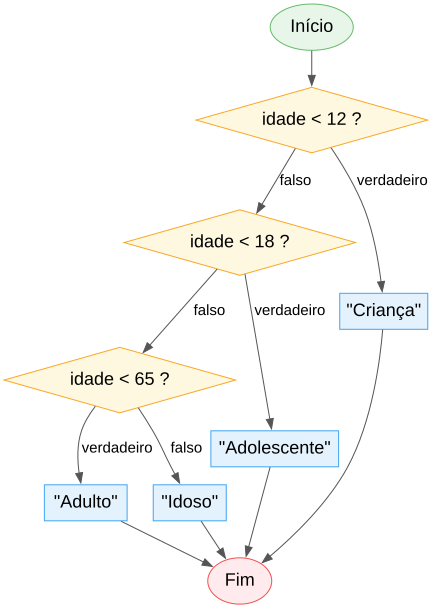

# Aula 4

## Decisões

`se`, `senao`, `senao se`, e `escolher`

---

## Recapitulando

- **Aula 1:** algoritmo, `escrever`/`ler`
- **Aula 2:** os 5 tipos, `constante`
- **Aula 3:** operadores aritméticos, relacionais, lógicos — todos devolvem valores
- Hoje: usar esses valores `booleano` para o programa **decidir** o que fazer

---

## Objetivos de hoje

- Fazer o programa escolher um caminho com `se` / `senao`
- Encadear várias condições com `senao se`
- Usar `escolher` quando há muitas opções para o mesmo valor
- Entender uma armadilha sobre onde as variáveis "vivem"

---

## O que é uma decisão

No dia a dia, decidimos constantemente com base em condições:

- **Se** está a chover, levo o chapéu-de-chuva
- **Se** o semáforo está verde, ando; **senão**, paro
- **Se** a nota é positiva, passo; **senão**, chumbo

Um programa precisa da mesma capacidade.

---

# `se` / `senao`

---

## Sintaxe

```algo
se condicao entao
    // corre se a condição for verdadeira
senao
    // corre se a condição for falsa
```

A condição é sempre um `booleano` — normalmente o resultado de uma comparação.

---

## Exemplo

```algo
algoritmo "VerificaIdade"

inicio
    idade:inteiro
    escrever("Idade: ")
    ler(idade)

    se idade >= 18 entao
        escrever("Maior de idade")
    senao
        escrever("Menor de idade")
```

---

## Em fluxograma


---

## Armadilha: a condição TEM de ser `booleano`

```algo
idade:inteiro = 0
// se idade entao          // ERRO de compilação!
se idade <> 0 entao         // certo: escreve a comparação por extenso
    escrever("tem idade definida")
```

Ao contrário de C ou Python, um número **não** vale como condição (0 = falso, resto = verdadeiro). Tem de ser sempre uma comparação ou variável `booleano`.

---

## `senao` é opcional

```algo
nota:decimal = 15.0

se nota >= 9.5 entao
    escrever("Aprovado")
```

Se a condição for falsa e não houver `senao`, o programa simplesmente não faz nada ali e continua.

---

## Blocos, na mesma regra de sempre

O que está indentado a mais pertence ao `se` (ou ao `senao`):

```algo
se idade >= 18 entao
    escrever("Maior de idade")
    escrever("Pode votar")
senao
    escrever("Menor de idade")
```

As duas linhas do primeiro bloco correm juntas quando a condição é verdadeira.

---

# `senao se` — várias condições

---

## Quando uma decisão não chega

Nem sempre a resposta é só "sim ou não". Pensa numa classificação de nota: excelente, bom, suficiente ou reprovado — quatro hipóteses, não duas.

---

## Sintaxe

```algo
se condicao1 entao
    ...
senao se condicao2 entao
    ...
senao se condicao3 entao
    ...
senao
    ...
```

---

## Exemplo: escalão etário

```algo
algoritmo "ClassificadorEtario"

inicio
    idade:inteiro
    escrever("Idade: ")
    ler(idade)

    se idade < 12 entao
        escrever("Criança")
    senao se idade < 18 entao
        escrever("Adolescente")
    senao se idade < 65 entao
        escrever("Adulto")
    senao
        escrever("Idoso")
```

---

## Em fluxograma



Cada losango só é testado se o anterior deu falso — é uma "escada" de perguntas.

---

## A ordem importa!

As condições são testadas de cima para baixo, e **só o primeiro** ramo verdadeiro corre — mesmo que uma condição mais abaixo também fosse verdadeira.

```algo
nota:decimal = 16.0

se nota >= 9.5 entao
    escrever("Suficiente")     // esta corre! é a primeira a bater certo
senao se nota >= 14.0 entao
    escrever("Bom")             // nunca chega aqui, mesmo sendo também verdade
```

Por isso a ordem das condições tem de fazer sentido (normalmente da mais específica/exigente para a mais geral).

---

# `escolher` — muitas opções, um valor

---

## Quando usar

Quando comparamos sempre a **mesma** variável contra vários valores possíveis, uma cadeia longa de `senao se` fica repetitiva. `escolher` é mais direto.

---

## Sintaxe

```algo
escolher expressao
    caso valor1
        ...
    caso valor2
        ...
    contrario
        ...
```

---

## Exemplo: estação do ano

```algo
algoritmo "EstacaoDoAno"

inicio
    mes:inteiro
    escrever("Mês (1-12): ")
    ler(mes)

    escolher mes
        caso 12, 1, 2
            escrever("Inverno")
        caso 3, 4, 5
            escrever("Primavera")
        caso 6, 7, 8
            escrever("Verão")
        caso 9, 10, 11
            escrever("Outono")
        contrario
            escrever("Mês inválido")
```

---

## Em fluxograma


Ao contrário da "escada" do `senao se`, aqui todos os ramos saem do **mesmo** ponto — só um é escolhido.

---

## Vários valores no mesmo `caso`

`caso 12, 1, 2` corre se `mes` for igual a **qualquer um** destes três valores — não precisas de um `caso` por valor.

---

## Sem "queda" para o caso seguinte

Ao contrário de outras linguagens, um `caso` em ALGO **nunca** cai para o seguinte. Só um ramo corre: o primeiro cujo valor bate certo. Não precisas de nada tipo `sair`/`break` no fim.

`contrario` é opcional, tal como `senao` em `se`.

---

# Onde vivem as variáveis

---

## Armadilha: uma variável criada dentro de um ramo desaparece fora dele

```algo
x:inteiro = 5
se x > 0 entao
    sinal:cadeia = "positivo"
    escrever(sinal)          // ok, ainda estamos dentro do 'se'

// escrever(sinal)           // ERRO: 'sinal' já não existe aqui
```

Isto acontece mesmo que a mesma variável seja declarada em **todos** os ramos.

---

## Como resolver

Declara a variável **antes** do `se`, e só atribui valor dentro de cada ramo:

```algo
idade:inteiro = 20
estado:cadeia                  // declarada antes, sem valor inicial

se idade >= 18 entao
    estado = "adulto"           // atribuição, sem ':tipo'
senao
    estado = "menor"

escrever(estado)                // válido: 'estado' existe aqui
```

---

## Em diagrama


A caixa amarela ("dentro do `se`") é temporária — o que é criado só lá dentro não sai de lá.

---

## Exemplo completo

```algo
algoritmo "ClassificadorTriangulo"

inicio
    a:decimal
    b:decimal
    c:decimal
    escrever("Lado a: ")
    ler(a)
    escrever("Lado b: ")
    ler(b)
    escrever("Lado c: ")
    ler(c)

    se a + b <= c ou a + c <= b ou b + c <= a entao
        escrever("Não é um triângulo válido")
    senao se a == b e b == c entao
        escrever("Equilátero")
    senao se a == b ou b == c ou a == c entao
        escrever("Isósceles")
    senao
        escrever("Escaleno")
```

---

## Resumo

- `se condicao entao ... senao ...` — a condição é sempre `booleano`
- `senao se` encadeia várias condições; só a primeira verdadeira corre
- `escolher`/`caso`/`contrario` para comparar um valor a muitas opções, sem "queda" entre casos
- Uma variável declarada dentro de um ramo só existe ali — declara-a antes do `se` se precisares dela depois

---

## Próxima aula

Vamos ver os **ciclos**: como repetir passos sem escrever o mesmo código muitas vezes — `para` (repetição contada) e `enquanto`/`repetir` (repetição condicionada).

---

## Agora é a tua vez!

Abre a ficha de trabalho da Aula 4 e resolve os exercícios.
