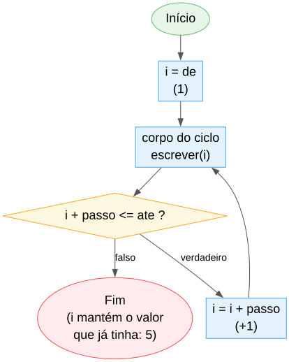
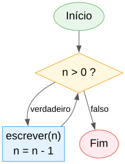
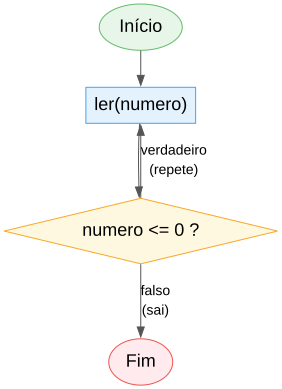

# Aula 5

## Ciclos

Repetir passos sem repetir código: `para`, `enquanto` e `fazer ... enquanto`

---

## Recapitulando

- **Aula 1-3:** algoritmo, tipos, operadores
- **Aula 4:** o programa decide o caminho com `se` / `senao se` / `escolher`
- Hoje: fazer o programa **repetir** passos, em vez de escrevê-los muitas vezes

---

## Objetivos de hoje

- Repetir um número certo de vezes com `para`
- Repetir enquanto uma condição for verdadeira, com `enquanto`
- Repetir pelo menos uma vez, com `fazer ... enquanto`
- Parar ou saltar uma repetição com `sair` / `continuar`
- Ver, passo a passo, o que acontece **na memória** durante um ciclo

---

## O que é um ciclo

No dia a dia, repetimos ações constantemente:

- Dar 10 voltas à pista, a correr
- Lavar cada prato da pilha, um a um, até acabarem
- Pedir a senha outra vez e outra vez, até estar certa

Um **ciclo** (ou "loop") é a forma de dizer ao programa: repete isto.

---

## Porque não escrever tudo à mão?

```algo
escrever(1)
escrever(2)
escrever(3)
escrever(4)
escrever(5)
```

Funciona para 5 números... e para 1000? Um ciclo faz o mesmo com poucas linhas, e funciona para qualquer tamanho.

---

## Dois tipos de ciclo

| Tipo | Uso | Em ALGO |
|---|---|---|
| **Contado** | já sei quantas vezes | `para` |
| **Condicionado** | repito até algo acontecer, não sei quantas vezes à partida | `enquanto` / `fazer ... enquanto` |

---

# `para` — repetição contada

---

## Sintaxe

```algo
i:inteiro
para i de 1 ate 5 fazer
    escrever(i)
```

Saída: `1 2 3 4 5`

---

## Em fluxograma



O ciclo **volta atrás** e testa outra vez — é isso que faz "repetir".

---

## Na memória, volta a volta

Lembra-te: uma variável é uma **caixa com nome** (Aula 2). Num ciclo, a mesma caixa `i` vai mudando de valor:


Não há 5 caixas — é sempre a **mesma** caixa `i`, com o conteúdo a mudar.

---

## Armadilha: a variável tem de existir antes

```algo
para i de 1 ate 5 fazer     // ERRO! 'i' não foi declarada
    escrever(i)
```

Certo:

```algo
i:inteiro                    // declarada ANTES do ciclo
para i de 1 ate 5 fazer
    escrever(i)
```

---

## `ate` inclui o último valor

```algo
para i de 1 ate 5 fazer
    escrever(i)
// mostra 1 2 3 4 5 -- o 5 também conta
```

E depois do ciclo terminar, `i` continua a existir, com o último valor que teve (`5`, não `6`).

---

## `passo` — saltar de quanto em quanto

```algo
i:inteiro
para i de 10 ate 2 passo -2 fazer
    escrever(i)
// mostra 10 8 6 4 2
```

Sem `passo`, o valor por omissão é `1` (sempre a subir). Com `passo` negativo, conta a descer.

---

## Armadilha: `passo` que não bate certo com `de`/`ate`

```algo
para i de 1 ate 10 passo -1 fazer
    escrever(i)
// não corre NENHUMA vez -- não é erro, só um ciclo vazio
```

`passo` igual a `0` é sempre erro (o ciclo nunca avançaria). `de`, `ate` e `passo` só aceitam `inteiro`.

---

# `enquanto` — repetição condicionada

---

## Sintaxe

```algo
n:inteiro = 10
enquanto n > 0 fazer
    escrever(n)
    n = n - 1
```

Repete **enquanto** a condição for verdadeira. Aqui não sabemos à partida quantas vezes — depende do valor de `n`.

---

## Em fluxograma



---

## Na memória, volta a volta

*(exemplo com `n = 3`, para caber no diagrama — com `n = 10` o raciocínio é igual, só mais longo)*


Repara que `n` é atualizado **antes** de a condição ser testada outra vez.

---

## A condição é testada ANTES

```algo
n:inteiro = 0
enquanto n > 0 fazer
    escrever(n)
// nunca escreve nada! a condição já começa falsa
```

Se a condição começar falsa, o corpo do ciclo **nunca** corre, nem uma vez.

---

# `fazer ... enquanto` — testa no fim

---

## Sintaxe

```algo
opcao:inteiro
fazer
    escrever("1) Somar  2) Sair -- escolhe: ")
    ler(opcao)
enquanto opcao <> 1 e opcao <> 2

escrever("Escolheste ", opcao)
```

---

## Em fluxograma



Repara: o corpo vem **antes** do teste.

---

## Na memória, tentativa a tentativa

*(exemplo: pedir um número até ser positivo)*


A mesma caixa `numero` é reescrita a cada tentativa, até um valor válido "sobreviver" ao teste.

---

## A condição é testada DEPOIS

Ao contrário de `enquanto`, o corpo de `fazer ... enquanto` corre **sempre pelo menos uma vez** — mesmo que a condição já comece falsa.

É o padrão certo para "pede um valor até ser válido": não há nada para testar antes da primeira leitura.

---

## `enquanto` vs. `fazer ... enquanto`

| | Testa a condição | Corre pelo menos 1 vez? |
|---|---|---|
| `enquanto` | antes de cada volta | não, pode nunca correr |
| `fazer ... enquanto` | depois de cada volta | sim, sempre |

---

# `sair` e `continuar`

---

## `sair` — termina o ciclo já

```algo
i:inteiro
para i de 1 ate 100 fazer
    se i > 5 entao
        sair                 // sai do ciclo imediatamente
    escrever(i)
// mostra 1 2 3 4 5
```

---

## `continuar` — salta para a próxima volta

```algo
i:inteiro
para i de 1 ate 5 fazer
    se i == 3 entao
        continuar             // salta o resto desta volta
    escrever(i)
// mostra 1 2 4 5  -- o 3 nunca chega ao escrever
```

---

## Os dois juntos

```algo
i:inteiro
para i de 1 ate 20 fazer
    se i mod 2 <> 0 entao
        continuar          // ímpares: salta já para o próximo i
    se i > 10 entao
        sair                // para de todo o ciclo aqui
    escrever(i)
// mostra 2 4 6 8 10
```

---

## Em fluxograma


---

## Notas importantes

- `sair`/`continuar` só valem dentro de um ciclo — usados fora, são erro
- Afetam sempre o ciclo **mais interior** (o de dentro, se houver vários)
- Dentro de um `escolher`, continuam a afetar o ciclo à volta — um `escolher` não tem "sair de um caso" próprio

---

# Dois padrões muito comuns

---

## Padrão: acumular um total

```algo
soma:inteiro = 0            // começa a zero, ANTES do ciclo
i:inteiro
para i de 1 ate 5 fazer
    soma = soma + i           // vai somando a cada volta

escrever(soma)                // 15
```

A variável do total é declarada **antes** do ciclo, com o valor inicial (`0`).

---

## Na memória, volta a volta


A cada volta, `soma = soma + i` lê o valor **antigo** de `soma`, soma-lhe `i`, e guarda o resultado de volta na **mesma** caixa `soma`.

---

## Padrão: contar quantos cumprem uma condição

```algo
contagem:inteiro = 0
i:inteiro
para i de 1 ate 10 fazer
    se i mod 2 == 0 entao
        contagem = contagem + 1

escrever(contagem)             // 5 -- quantos pares há de 1 a 10
```

Mesma ideia: um contador que começa a `0` antes do ciclo, e cresce lá dentro.

---

## Exemplo completo

```algo
algoritmo "TabuadaComParagem"

inicio
    base:inteiro
    escrever("Tabuada de: ")
    ler(base)

    i:inteiro
    para i de 1 ate 10 fazer
        resultado:inteiro = base * i
        se resultado > 50 entao
            escrever("(parado -- resultado passou de 50)")
            sair
        escrever(base, " x ", i, " = ", resultado)
```

---

## Resumo

- `para i de A ate B [passo P] fazer` — repetição contada; `i` declarada antes; `ate` inclusivo
- `enquanto condicao fazer` — testa antes; pode nunca correr
- `fazer ... enquanto condicao` — testa depois; corre sempre pelo menos 1 vez
- `sair` termina o ciclo; `continuar` salta para a próxima volta
- Acumulador e contador: variável a `0` antes do ciclo, atualizada lá dentro
- Num ciclo há sempre a **mesma** caixa de memória a ser reescrita, volta a volta — nunca uma caixa nova

---

## Próxima aula

Aula de **revisão**: vamos juntar tudo o que vimos até agora (Aulas 1 a 5) em exercícios que combinam tipos, operadores, decisões e ciclos — sem matéria nova.

---

## Agora é a tua vez!

Abre a ficha de trabalho da Aula 5 e resolve os exercícios.
