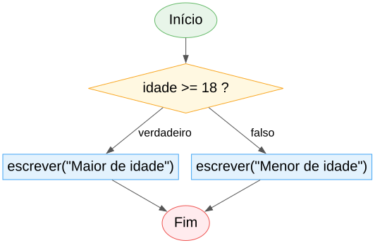
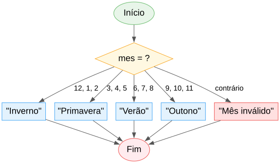
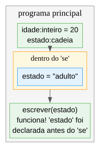

# Aula 6

## Revisão

Aulas 1 a 5 — sem matéria nova, só consolidar

---

## Porque parar para rever

Já vimos bastante em 5 aulas: tipos, operadores, decisões, ciclos. Antes de continuar para coisas novas (vetores, funções, ...), vale a pena parar e garantir que a base está sólida — é sobre ela que tudo o resto se constrói.

---

## O que vamos rever

1. Algoritmos e o primeiro programa
2. Tipos e `constante`
3. Operadores
4. Decisões
5. Ciclos
6. As armadilhas mais comuns até agora

---

# Aula 1 — Algoritmos

---

## Cheat sheet: o primeiro programa

```algo
algoritmo "NomeDoPrograma"

inicio
    // comentário
    nome:cadeia
    escrever("Como te chamas? ")
    ler(nome)
    escrever("Olá, ", nome, "!")
```

- `algoritmo "Nome"` sempre na primeira linha
- `inicio` marca o começo; **não há `fim`** — o bloco acaba quando a indentação desce
- Blocos formam-se por indentação (1 tab OU 4 espaços, nunca misturados)

---

# Aula 2 — Tipos e `constante`

---

## Cheat sheet: os 5 tipos primitivos

| Tipo | Guarda | Valor por omissão |
|---|---|---|
| `inteiro` | número inteiro | `0` |
| `decimal` | número com casas decimais | `0.0` |
| `booleano` | verdadeiro/falso | `falso` |
| `cadeia` | texto | `""` |
| `caracter` | exatamente 1 símbolo | `' '` |

`nome:tipo` — sempre o tipo depois dos dois pontos.

---

## Cheat sheet: `constante`

```algo
constante IVA:decimal = 1.23
```

- Tem sempre de ter valor inicial
- Nunca pode ser reatribuída
- Antes de `inicio` = global; dentro de `inicio`/função = só local

---

# Aula 3 — Operadores

---

## Cheat sheet: aritméticos

| Operador | Faz | Nota |
|---|---|---|
| `+` `-` `*` | como na escola | |
| `/` | divisão | **sempre** `decimal` |
| `div` | divisão inteira | só entre `inteiro` |
| `mod` | resto | só entre `inteiro` |
| `^` | potência | associativo à direita |

---

## Cheat sheet: relacionais e lógicos

```algo
==  <>  <  >  <=  >=       // devolvem booleano; não se encadeiam!
e   ou   nao                // só entre booleano
```

`a < b < c` é **erro** de compilação — escreve `a < b e b < c`.

---

## Cheat sheet: precedência (resumida)

Do que liga primeiro para o que liga por último:

```
^   >   - (negativo)   >   * / div mod   >   + -   >   comparações   >   nao   >   e   >   ou
```

Na dúvida, usa parênteses.

---

# Aula 4 — Decisões

---

## Revisão visual: `se` / `senao`



A condição é **sempre** `booleano` — nunca um número diretamente.

---

## Revisão visual: `escolher`



Sem "queda" para o caso seguinte — só um ramo corre.

---

## Revisão: âmbito de variáveis



Precisas do valor depois do `se`? Declara a variável **antes**.

---

# Aula 5 — Ciclos

---

## Revisão visual: `para`


`i` tem de estar declarada **antes** do ciclo. `ate` é inclusivo.

---

## Revisão: `enquanto` vs. `fazer ... enquanto`

| | Testa | Corre pelo menos 1 vez? |
|---|---|---|
| `enquanto` | antes | não |
| `fazer ... enquanto` | depois | sim |

---

## Revisão: `sair`, `continuar`, e os dois padrões

```algo
sair          // termina o ciclo já
continuar     // salta para a próxima volta

soma:inteiro = 0          // acumulador: 0 antes do ciclo
contagem:inteiro = 0       // contador: 0 antes do ciclo
para i de 1 ate 5 fazer
    soma = soma + i
    se i mod 2 == 0 entao
        contagem = contagem + 1
```

---

# As armadilhas mais comuns

---

## 6 erros que todos cometemos ao início

1. `se idade entao` — a condição tem de ser `booleano`, nunca um número
2. `"Idade: " + idade` — `+` não mistura texto com número
3. `para i de 1 ate 5 fazer` sem `i:inteiro` antes — erro
4. Usar uma variável declarada dentro de um `se`/`escolher` fora dele
5. Esquecer que `senao se` só corre o **primeiro** ramo verdadeiro
6. Esquecer o acumulador/contador a `0` **antes** do ciclo, não dentro dele

---

## Exemplo integrador: jogo de adivinhar

Junta `constante`, `fazer ... enquanto`, decisões encadeadas, e um contador — tudo o que vimos até agora:

```algo
algoritmo "JogoAdivinhar"

constante NUMERO_SECRETO:inteiro = 42

inicio
    palpite:inteiro
    tentativas:inteiro = 0

    fazer
        escrever("Palpite: ")
        ler(palpite)
        tentativas = tentativas + 1

        se palpite < NUMERO_SECRETO entao
            escrever("Mais alto!")
        senao se palpite > NUMERO_SECRETO entao
            escrever("Mais baixo!")
    enquanto palpite <> NUMERO_SECRETO

    escrever("Acertaste em ", tentativas, " tentativas!")
```

---

## Resumo da revisão

- Programa: `algoritmo` + `inicio`, blocos por indentação
- 5 tipos + `constante`; `+` não mistura texto com número
- Operadores: aritméticos, relacionais (não se encadeiam), lógicos
- Decisões: `se`/`senao se`/`escolher`; atenção ao âmbito
- Ciclos: `para` (contado) e `enquanto`/`fazer...enquanto` (condicionado); `sair`/`continuar`; acumulador/contador

---

## Próxima aula

Depois desta consolidação, avançamos para **vetores e matrizes**: como guardar e organizar muitos valores relacionados numa só variável.

---

## Agora é a tua vez!

Abre a ficha de trabalho da Aula 6 — junta tudo o que vimos até aqui.
