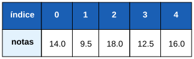

# Aula 7

## Vetores e Matrizes

Guardar muitos valores relacionados numa só variável

---

## Recapitulando

- **Aulas 1-5:** tipos, operadores, decisões, ciclos
- **Aula 6:** revisão
- Até agora, uma variável guarda **um** valor de cada vez
- Hoje: uma variável que guarda **muitos** valores, todos do mesmo tipo

---

## Objetivos de hoje

- Declarar e usar um vetor (lista de valores)
- Percorrer um vetor com `para`
- Declarar e usar uma matriz (tabela de valores)
- Conhecer as armadilhas mais importantes

---

## O problema

Imagina guardar as notas de 30 alunos:

```algo
nota1:decimal
nota2:decimal
nota3:decimal
// ... mais 27 variáveis?!
```

Impraticável — e nem sabemos calcular a média sem escrever `nota1 + nota2 + ... + nota30` à mão.

---

## A solução: um vetor

Pensa numa fila de caixas de correio, todas numeradas, uma ao lado da outra — é isso que é um **vetor**: várias caixas do mesmo tipo, com um único nome, distinguidas por um número (o **índice**).

---

# Vetores (1 dimensão)

---

## Declarar um vetor

```algo
notas:decimal[5]        // um vetor de 5 posições, todas 0.0
```

`nome:tipo[tamanho]` — tal como uma variável normal, mas com o tamanho entre `[ ]`.

---

## Os índices começam em 0



O primeiro elemento é `notas[0]`, não `notas[1]`. O último de um vetor de tamanho 5 é `notas[4]` — não `notas[5]`.

---

## Aceder e atribuir uma posição

```algo
notas:decimal[5]
notas[0] = 18.5
escrever(notas[0])          // 18.5
```

Cada posição do vetor comporta-se como uma variável normal, só que identificada por `nome[indice]` em vez de um nome próprio.

---

## Sem valor inicial

```algo
idades:inteiro[3]
escrever(idades[0])          // 0 -- valor por omissão de 'inteiro'
```

Tal como uma variável normal, cada posição começa com o valor por omissão do tipo (Aula 2) se não lhe deres um valor.

---

## Literal `{ }`

```algo
primos:inteiro[5] = {2, 3, 5, 7, 11}
escrever(primos[0], primos[4])       // 2 11
```

O literal tem de ter **exatamente** o número de elementos do tamanho declarado.

---

## Armadilha: o literal tem de bater certo

```algo
// primos:inteiro[5] = {2, 3, 5}         // ERRO! só 3 valores para 5 posições
// primos:inteiro[5] = {2, 3, 5, 7, 11, 13}  // ERRO! 6 valores a mais
```

Nem preenchimento automático, nem corte silencioso — é sempre erro de compilação.

---

## Percorrer um vetor com `para`

```algo
notas:decimal[5] = {14.0, 9.5, 18.0, 12.5, 16.0}
i:inteiro
soma:decimal = 0.0
para i de 0 ate 4 fazer
    soma = soma + notas[i]
escrever("Média: ", soma / 5)
```

Já sabes fazer isto desde a Aula 5 — só muda que agora `i` é usado para indexar o vetor.

---

## Padrão: guardar o tamanho numa `constante`

```algo
constante TAMANHO:inteiro = 5
notas:decimal[TAMANHO] = {14.0, 9.5, 18.0, 12.5, 16.0}
i:inteiro
para i de 0 ate TAMANHO - 1 fazer
    escrever(notas[i])
```

Assim só mudas o tamanho num sítio, se precisares de o alterar.

---

## Armadilha: índices inválidos

```algo
v:inteiro[5] = {1, 2, 3, 4, 5}
// escrever(v[5])       // erro em RUNTIME -- só 0..4 são válidos
```

Ao contrário de erros de tipo (detetados ao compilar), um índice fora do intervalo só é detetado quando o programa **corre**.

---

## Armadilha: índices negativos NÃO contam do fim

```algo
v:inteiro[5] = {1, 2, 3, 4, 5}
// escrever(v[-1])      // erro em runtime -- NÃO devolve o último elemento!
```

Se conheces Python, isto é diferente: `v[-1]` **não** é um atalho para o último elemento em ALGO. É só um índice inválido.

---

## O tamanho pode vir de uma variável

```algo
n:inteiro
escrever("Quantos números? ")
ler(n)

v:inteiro[n]
i:inteiro
para i de 0 ate n - 1 fazer
    v[i] = i * i
```

O tamanho não precisa de ser um número fixo escrito no código — pode ser calculado quando o programa corre.

---

## Armadilha: um vetor não se copia com `=`

```algo
v1:inteiro[3] = {1, 2, 3}
v2:inteiro[3]
// v2 = v1                // ERRO! um vetor não pode ser atribuído assim
```

Ao contrário de uma variável normal, `=` **não** funciona entre dois vetores inteiros.

---

## Como copiar um vetor de verdade

```algo
v1:inteiro[3] = {1, 2, 3}
v2:inteiro[3]
i:inteiro
para i de 0 ate 2 fazer
    v2[i] = v1[i]              // copiar elemento a elemento

v2[0] = 99
escrever(v1[0], " ", v2[0])     // 1 99 -- são independentes
```

---

# Matrizes (2+ dimensões)

---

## O que é uma matriz

Um vetor guarda uma **fila** de valores. Uma matriz guarda uma **grelha**: linhas e colunas — como um tabuleiro de jogo do galo, ou uma tabela de calendário.

---

## Declarar uma matriz

```algo
tabuleiro:inteiro[3][3]
tabuleiro[0][0] = 1
tabuleiro[1][1] = 1
tabuleiro[2][2] = 1
```

`tipo[linhas][colunas]` — cada par de `[ ]` indexa mais uma dimensão.

---

## Em tabela


`m[i][j]` — primeiro o índice da **linha**, depois o da **coluna**.

---

## Literal aninhado

```algo
m:inteiro[2][2] = {{1, 2}, {3, 4}}
escrever(m[0][1], " ", m[1][0])     // 2 3
```

Tantos níveis de `{ }` quantas dimensões tem a matriz.

---

## Percorrer uma matriz: `para` aninhados

```algo
m:inteiro[2][3] = {{1, 2, 3}, {4, 5, 6}}
i:inteiro
j:inteiro
para i de 0 ate 1 fazer
    para j de 0 ate 2 fazer
        escrever(m[i][j])
```

Um `para` para as linhas, outro **dentro dele** para as colunas.

---

## Cada linha é independente

![Duas tabelas lado a lado: antes, m0 e m1 têm ambas os valores 1 e 2; depois de m0[0] ser mudado para 99, m0 fica 99 e 2, mas m1 continua 1 e 2, sem ser afetado](diagramas/07-vetores-e-matrizes/matriz-linhas-independentes.svg)

Mudar `m[0][0]` **nunca** afeta `m[1][0]` — cada linha tem a sua própria memória.

---

## Mais dimensões, se precisares

```algo
cubo:inteiro[3][3][3]
cubo[0][0][0] = 1
```

Podes ter tantas dimensões quantas precisares — cada `[ ]` a mais indexa mais um nível.

---

## Exemplo completo

```algo
algoritmo "NotasDaTurma"

inicio
    n:inteiro
    escrever("Quantos alunos? ")
    ler(n)

    notas:decimal[n]
    i:inteiro
    para i de 0 ate n - 1 fazer
        escrever("Nota do aluno ", i + 1, ": ")
        ler(notas[i])

    soma:decimal = 0.0
    maior:decimal = notas[0]
    para i de 0 ate n - 1 fazer
        soma = soma + notas[i]
        se notas[i] > maior entao
            maior = notas[i]

    escrever("Média da turma: ", soma / n)
    escrever("Nota mais alta: ", maior)
```

---

## Resumo

- `nome:tipo[tamanho]` — índices de `0` a `tamanho - 1`
- Literal `{...}` tem de ter exatamente o tamanho certo
- Índice inválido (incluindo negativo) é erro em **runtime**, nunca conta a partir do fim
- Um vetor **não** se copia com `=` — copia elemento a elemento
- Matriz: `tipo[linhas][colunas]`, `m[i][j]`, cada linha independente
- `para` aninhados para percorrer matrizes

---

## Próxima aula

Vamos ver **funções e procedimentos**: como organizar código em blocos reutilizáveis, com nome próprio, para não repetir a mesma lógica várias vezes.

---

## Agora é a tua vez!

Abre a ficha de trabalho da Aula 7 e resolve os exercícios.
