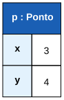
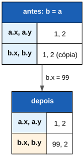
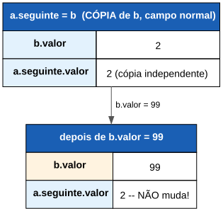
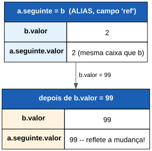

# Aula 9

## Estruturas

Agrupar vários valores relacionados numa única variável

---

## Recapitulando

- **Aula 7:** vetores — muitos valores do **mesmo** tipo
- **Aula 8:** funções e procedimentos — lógica reutilizável
- Hoje: agrupar valores de tipos **diferentes**, mas relacionados entre si

---

## Objetivos de hoje

- Definir e usar uma `estrutura`
- Perceber que `estrutura` copia por valor (ao contrário de vetor!)
- Passar uma `estrutura` por referência
- Vetor de estruturas, e estrutura com campo vetor
- Estruturas recursivas (listas ligadas) e campos `ref`

---

## O problema

```algo
pontoX:inteiro = 3
pontoY:inteiro = 4
```

Duas variáveis separadas, mas que só fazem sentido **juntas** (representam um ponto). Nada impede de as confundir, ou esquecer uma delas ao passares os dados a uma função.

---

## A solução: uma `estrutura`

Pensa numa **ficha**: um "Ponto" tem sempre um `x` e um `y`; uma "Pessoa" tem sempre um nome e uma idade. Uma `estrutura` agrupa campos relacionados debaixo de um único nome.

---

# Definir e usar

---

## Sintaxe

```algo
estrutura Ponto
    x:inteiro
    y:inteiro

inicio
    p:Ponto = {x: 3, y: 4}
    escrever(p.x, ", ", p.y)      // 3, 4
```

- `estrutura Nome`, um campo `nome:tipo` por linha, declarada fora de `inicio`
- Constrói-se com `{campo: valor, ...}` — a ordem dos campos no literal não importa
- Acede-se e atribui-se com `.`: `p.x`, `p.x = 10`

---

## Em diagrama



---

## Campos omitidos ficam com o valor por omissão

```algo
p:Ponto = {x: 3}
escrever(p.x, ", ", p.y)      // 3, 0 -- 'y' não foi dado, fica 0
```

Cada campo que faltar no literal recebe o valor por omissão do seu tipo (Aula 2) — nunca fica "por definir".

---

## Igualdade compara campo a campo

```algo
a:Ponto = {x: 1, y: 2}
b:Ponto = {x: 1, y: 2}
escrever(a == b)              // verdadeiro
```

`==`/`<>` entre duas `estrutura` do mesmo tipo comparam **todos os campos**, não se "são a mesma variável".

---

# `estrutura` copia por valor

---

## Diferente de vetor!

Lembra-te da Aula 7: um vetor **não** se copia com `=`. Uma `estrutura` é o oposto — copia normalmente:

```algo
a:Ponto = {x: 1, y: 2}
b:Ponto = a
b.x = 99
escrever(a.x, " ", b.x)       // 1 99 -- independentes
```

---

## Em diagrama



Isto vale em **todo** o sítio onde um valor `estrutura` circula: atribuição, `retornar`, passar como argumento sem `ref`, e **atribuir a um campo**.

---

# Passar por referência

---

## `ref` numa `estrutura`

```algo
procedimento deslocar(ref p:Ponto, dx:inteiro, dy:inteiro)
    p.x = p.x + dx
    p.y = p.y + dy

inicio
    p:Ponto = {x: 0, y: 0}
    deslocar(p, 5, 3)
    escrever(p.x, " ", p.y)       // 5 3
```

Tal como um parâmetro escalar (Aula 8), `ref` faz a função mutar diretamente a variável do chamador.

---

# Vetores + Estruturas

---

## Vetor de estruturas

```algo
pontos:Ponto[2] = {{x: 1, y: 1}, {x: 2, y: 2}}
escrever(pontos[0].x, ", ", pontos[1].y)     // 1, 2
```

Cada posição do vetor é uma `Ponto` completa.

---

## Estrutura com campo vetor

```algo
estrutura Poligono
    lados:inteiro[3]

inicio
    p:Poligono = {lados: {3, 4, 5}}
    escrever(p.lados[0], " ", p.lados[1], " ", p.lados[2])
```

Um campo também pode ser um vetor.

---

# Estruturas recursivas

---

## Um campo pode ser do mesmo tipo da estrutura

```algo
estrutura No
    valor:inteiro
    seguinte:No
```

Útil para representar uma sequência: cada nó aponta para "o próximo". Se omitido, fica `nulo` por omissão — nunca tenta construir-se a si próprio infinitamente.

---

## Percorrer até ao fim

```algo
procedimento imprimir(lista:No)
    n:No = lista
    enquanto n <> nulo fazer
        escrever(n.valor)
        n = n.seguinte
```

`nulo` é o único valor que se pode comparar com `==`/`<>` contra qualquer `estrutura` — dá o idioma habitual de "percorrer até acabar".

---

## Armadilha: construir de uma vez, não ligar depois

Como `estrutura` copia por valor **mesmo ao atribuir a um campo**, não há forma de duas variáveis partilharem o "mesmo" nó com um campo normal:

```algo
b:No = {valor: 2, seguinte: nulo}
a:No = {valor: 1, seguinte: b}    // copia 'b' para dentro de a.seguinte
b.valor = 99                       // só muda a variável 'b'
escrever(a.seguinte.valor)         // 2 -- NÃO 99!
```

---

## Em diagrama



`a.seguinte` já era uma **cópia** de `b` no momento em que foi criada — deixou de estar "ligada" a ela.

---

## Campo `ref`: ligar sem copiar

```algo
estrutura No
    valor:inteiro
    seguinte:ref No
```

Um campo `ref` guarda um **alias** para outra instância já existente, em vez de copiar o valor.

```algo
b:No
b.valor = 2

a:No
a.valor = 1
a.seguinte = b               // agora ALIAS, não cópia

b.valor = 99
escrever(a.seguinte.valor)   // 99 -- reflete a mutação de 'b'
```

---

## Em diagrama



Compara com o diagrama anterior: só muda se o campo for `ref` ou não.

---

## Nota: `ref` só em campos de tipo `estrutura`

`ref` só é permitido num campo escalar (sem `[]`) cujo tipo seja outra `estrutura` — nunca num campo de tipo primitivo (`inteiro`, `decimal`, ...) nem num campo-vetor.

---

## Exemplo completo

```algo
algoritmo "CatalogoDeLivros"

estrutura Livro
    titulo:cadeia
    ano:inteiro
    lido:booleano

inicio
    livros:Livro[3]
    i:inteiro
    para i de 0 ate 2 fazer
        escrever("Título do livro ", i + 1, ": ")
        ler(livros[i].titulo)
        escrever("Ano: ")
        ler(livros[i].ano)
        livros[i].lido = falso

    livros[1].lido = verdadeiro

    para i de 0 ate 2 fazer
        estado:cadeia = "por ler"
        se livros[i].lido entao
            estado = "lido"
        escrever(livros[i].titulo, " (", livros[i].ano, ") -- ", estado)
```

---

## Resumo

- `estrutura Nome` com campos `nome:tipo`; literal `{campo: valor, ...}`; acede-se com `.`
- Campo omitido no literal = valor por omissão; `==`/`<>` comparam campo a campo
- `estrutura` copia por valor — **ao contrário de vetor** — em toda a parte, incluindo campos
- `ref` (parâmetro ou campo) evita a cópia: passa a ser um alias
- Vetor de estruturas, estrutura com campo vetor, e estruturas recursivas (com `nulo` por omissão)

---

## Próxima aula

Vamos ver **bibliotecas**: as ferramentas prontas a usar que já vêm com ALGO (`matematica`, `texto`, `conversao`, ...), através de `importar`.

---

## Agora é a tua vez!

Abre a ficha de trabalho da Aula 9 e resolve os exercícios.
