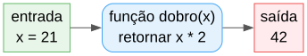

# Aula 8

## Funções e Procedimentos

Organizar código em blocos reutilizáveis, com nome próprio

---

## Recapitulando

- **Aulas 1-6:** tipos, operadores, decisões, ciclos, revisão
- **Aula 7:** vetores e matrizes — guardar muitos valores
- Hoje: guardar **lógica** reutilizável, não só dados

---

## Objetivos de hoje

- Distinguir `funcao` (devolve valor) de `procedimento` (não devolve)
- Passar parâmetros por valor e por referência (`ref`)
- Usar variáveis globais dentro de uma função
- Perceber recursão
- Passar um vetor como parâmetro

---

## O problema: código repetido

```algo
area1:decimal = 4.0 * 3.5
area2:decimal = 6.0 * 2.0
area3:decimal = 10.0 * 1.5
```

A mesma fórmula, escrita três vezes. E se a fórmula estiver errada? Tens de a corrigir em três sítios.

---

## A solução: uma função

Pensa numa **máquina**: metes coisas lá dentro (parâmetros), ela processa, e devolve um resultado. Escreves a "receita" da máquina **uma vez**, e usa-la quantas vezes quiseres.

---

## Em diagrama



---

# `funcao` vs. `procedimento`

---

## `funcao` — devolve sempre um valor

```algo
funcao dobro(x:inteiro):inteiro
    retornar x * 2
```

- O tipo do resultado vem **depois** dos parâmetros: `):tipo`
- Todo caminho de execução tem de terminar em `retornar <expressão>`

---

## `procedimento` — não devolve nada

```algo
procedimento saudar(nome:cadeia)
    escrever("Olá, ", nome, "!")
```

- Sem tipo de retorno
- `retornar` (sem valor) é opcional, só para sair mais cedo

---

## Declarar e chamar

```algo
algoritmo "Exemplo"

funcao dobro(x:inteiro):inteiro
    retornar x * 2

procedimento saudar(nome:cadeia)
    escrever("Olá, ", nome, "!")

inicio
    escrever(dobro(21))     // 42
    saudar("Rita")           // Olá, Rita!
```

Ambas são declaradas **fora** de `inicio`, antes do bloco principal.

---

## Armadilha: nem todo caminho pode "esquecer-se" de `retornar`

```algo
funcao sinal(x:inteiro):inteiro
    se x > 0 entao
        retornar 1
    senao se x < 0 entao
        retornar -1
    // ERRO! falta o caso x == 0
```

O compilador é conservador: um `se` sem `senao` **nunca** conta como cobrindo todos os casos, mesmo que pareça óbvio. Corrige sempre com um `senao` final.

---

# Parâmetros por valor (padrão)

---

## Uma cópia, não o original

```algo
funcao meio(x:decimal):decimal
    x = x / 2
    retornar x

inicio
    n:decimal = 10.0
    escrever(meio(n))    // 5.0
    escrever(n)            // 10.0 -- 'n' não mudou!
```

Sem `ref`, o parâmetro é uma **cópia**. Mudar o parâmetro dentro da função nunca afeta a variável do chamador.

---

## Em diagrama


---

# Parâmetros por referência (`ref`)

---

## A MESMA caixa, não uma cópia

```algo
procedimento trocar(ref a:inteiro, ref b:inteiro)
    tmp:inteiro = a
    a = b
    b = tmp

inicio
    x:inteiro = 1
    y:inteiro = 2
    trocar(x, y)
    escrever(x, " ", y)        // 2 1
```

`ref` faz o parâmetro apontar para a **mesma** variável do chamador.

---

## Em diagrama


---

## Regras de `ref` (mais estritas)

- O argumento tem de ser uma **variável** (ou posição de vetor/campo de estrutura) — nunca uma expressão calculada nem uma `constante`
- O tipo tem de ser **exatamente igual** — sem promoção `inteiro`→`decimal`
- A mesma variável não pode ser passada por `ref` duas vezes na mesma chamada

---

## Regra de `ref`: só como instrução isolada

```algo
inc(x)              // certo: instrução isolada
y = inc(x)           // certo: lado direito de uma atribuição
// escrever(inc(x))  // ERRO! não dentro de uma expressão maior
```

Uma chamada com algum parâmetro `ref` não pode aparecer no meio de uma expressão maior.

---

# Variáveis globais dentro de uma função

---

## Ler e escrever uma global, sem `ref`

```algo
algoritmo "Contador"

contador:inteiro = 0

procedimento incrementaContador()
    contador = contador + 1

inicio
    incrementaContador()
    incrementaContador()
    escrever(contador)    // 2
```

Uma variável global (declarada antes de `inicio`) pode ser lida e escrita diretamente por qualquer função — sem precisar de `ref`.

---

## Armadilha: uma variável local com o mesmo nome esconde a global

Se um parâmetro ou variável local tiver o mesmo nome de uma global, essa função deixa de conseguir aceder à global com esse nome — só vê a local.

---

# Recursão

---

## Uma função pode chamar-se a si própria

```algo
funcao fatorial(n:inteiro):inteiro
    se n <= 1 entao
        retornar 1
    retornar n * fatorial(n - 1)
```

Toda função recursiva precisa de:

- Um **caso base** que não chama mais nada (`n <= 1`)
- Um caso que se aproxima do caso base a cada chamada (`n - 1`)

---

## Em tabela: `fatorial(4)`, passo a passo


Cada chamada espera pelo resultado da seguinte antes de poder calcular o seu próprio.

---

# Vetor como parâmetro

---

## Colchetes vazios: `v:tipo[]`

```algo
funcao soma(v:inteiro[], tamanho:inteiro):inteiro
    total:inteiro = 0
    i:inteiro
    para i de 0 ate tamanho - 1 fazer
        total = total + v[i]
    retornar total

inicio
    numeros:inteiro[4] = {1, 2, 3, 4}
    escrever(soma(numeros, 4))     // 10
```

Um parâmetro `v:tipo[]` (sem tamanho) aceita um vetor de **qualquer** tamanho — por isso é normal passar também o tamanho.

---

## Nota: sem promoção de tipo nos elementos

O tipo dos elementos tem de ser **exatamente igual** ao declarado no parâmetro — tal como em `ref`, não há promoção `inteiro`→`decimal` aqui.

---

## Um vetor passado sem `ref` NÃO é copiado

```algo
procedimento dobrarElementos(v:inteiro[], tamanho:inteiro)
    i:inteiro
    para i de 0 ate tamanho - 1 fazer
        v[i] = v[i] * 2

inicio
    numeros:inteiro[3] = {1, 2, 3}
    dobrarElementos(numeros, 3)
    escrever(numeros[0], " ", numeros[1], " ", numeros[2])   // 2 4 6 -- mutado!
```

Tal como `v2 = v1` liga as duas variáveis na Aula 7, `v` dentro da função é o MESMO vetor que `numeros`. Mutar um elemento é visto pelo chamador; só reatribuir o parâmetro inteiro (`v = {...}`) é que fica preso à função.

---

## Na pilha e no heap


Um `inteiro` guarda o valor **diretamente** na sua caixa (`idade`). Um vetor guarda um **endereço** — a caixa `numeros` não tem `1 2 3` lá dentro, tem `0x2000`, o sítio no heap onde o vetor realmente vive.

---

## Duas variáveis, o mesmo endereço

Se `copia` for outra variável a apontar para o mesmo `0x2000` (por exemplo depois de `copia = numeros`, ou de `v` receber `numeros` como argumento), as duas veem o **mesmo** vetor. Mudar um elemento a partir de uma é visto pela outra — não porque haja magia, mas porque as duas caixas guardam o **mesmo número de endereço**.

---

## Em diagrama: dois destinos diferentes

![Diagrama de vetor por valor: o chamador tem numeros igual a 1,2,3, o parâmetro v recebe uma cópia do apontador que aponta para o mesmo vetor; um ramo muta um elemento (v[0] = v[0] vezes 2) e o vetor do chamador também muda para 2,2,3 -- mudou; o outro ramo reatribui o parâmetro inteiro (v = 9,9,9), a cópia do apontador passa a apontar para um vetor novo, e o vetor do chamador continua 1,2,3 -- não mudou](diagramas/08-funcoes-e-procedimentos/por-valor-vetor.svg)

Mesma cópia do apontador nos dois ramos — o que muda é **o que fazes com ela**: mutar um elemento afeta o original; substituir o vetor todo só troca para onde a cópia aponta.

---

## As três situações, lado a lado

| Situação | O parâmetro recebe | Mudar um elemento/campo | Reatribuir o parâmetro inteiro |
|---|---|---|---|
| escalar, por valor (padrão) | uma cópia do valor | *(não aplicável)* | não é visto pelo chamador |
| escalar, `ref` | a mesma caixa do chamador | *(não aplicável)* | é visto pelo chamador |
| vetor/estrutura, por valor (sem `ref`) | uma cópia do apontador, para o MESMO vetor/estrutura | é visto pelo chamador | não é visto pelo chamador |

---

## Exemplo completo

```algo
algoritmo "MaiorDivisorComum"

funcao mdc(a:inteiro, b:inteiro):inteiro
    se b == 0 entao
        retornar a
    retornar mdc(b, a mod b)

procedimento mostrarFracaoSimplificada(ref numerador:inteiro, ref denominador:inteiro)
    d:inteiro = mdc(numerador, denominador)
    numerador = numerador div d
    denominador = denominador div d

inicio
    n:inteiro
    d:inteiro
    escrever("Numerador: ")
    ler(n)
    escrever("Denominador: ")
    ler(d)

    mostrarFracaoSimplificada(n, d)
    escrever("Fração simplificada: ", n, "/", d)
```

---

## Resumo

- `funcao` devolve valor (sempre `retornar <expr>` em todos os caminhos); `procedimento` não
- Por valor (padrão), parâmetro **escalar**: cópia, o chamador nunca é afetado
- Por valor, parâmetro **vetor/estrutura**: NÃO é cópia — mutar um elemento/campo afeta o chamador; só reatribuir o parâmetro inteiro é que não propaga
- `ref`: aponta para a mesma variável (mesmo uma reatribuição completa propaga); regras estritas (variável, tipo exato, não repetir, só instrução isolada)
- Variável global: lida/escrita direta, sem `ref`
- Recursão: caso base + aproximação do caso base
- Vetor como parâmetro: `v:tipo[]`, sem promoção de tipo

---

## Próxima aula

Vamos ver **estruturas**: como agrupar vários valores relacionados (de tipos diferentes) numa única variável — por exemplo, um "Ponto" com `x` e `y`, ou uma "Pessoa" com nome e idade.

---

## Agora é a tua vez!

Abre a ficha de trabalho da Aula 8 e resolve os exercícios.
