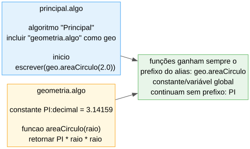

# Aula 10

## Bibliotecas, `incluir` e Tratamento de Erros

A última aula com matéria nova!

---

## Recapitulando

- **Aulas 1-9:** tipos, operadores, decisões, ciclos, vetores/matrizes, funções, estruturas
- Hoje: ferramentas prontas a usar, organizar código em vários ficheiros, e lidar com erros

---

## Objetivos de hoje

- Usar as bibliotecas embutidas da Linguagem Algorítmica (`Matematica`, `Cadeia`, `Conversao`)
- Juntar código de outro ficheiro teu com `incluir`
- Verificar suposições com `afirmar`
- Perceber os 3 momentos em que um erro pode aparecer

---

# Bibliotecas

---

## `importar`

```algo
algoritmo "Exemplo"

importar Matematica

inicio
    escrever(matematica.raiz(16))     // 4.0
```

- `importar Nome` no topo do ficheiro, antes de qualquer `funcao`/`inicio`
- Usa-se sempre `nome_em_minusculas.funcao(...)` para chamar
- Usar uma função sem `importar` primeiro é erro de **compilação**

---

## `Matematica`

| Função | O que faz |
|---|---|
| `raiz(x)` | raiz quadrada |
| `potencia(x, y)` | `x` elevado a `y`, sempre `decimal` |
| `absoluto(x)` | valor absoluto (mesmo tipo do argumento) |
| `piso(x)` / `teto(x)` | arredonda para baixo / para cima |
| `aleatorio(a, b)` | inteiro aleatório entre `a` e `b`, **incluindo os dois** |

---

## Exemplos

```algo
escrever(matematica.raiz(16))          // 4.0
escrever(matematica.absoluto(-5))      // 5       -- inteiro
escrever(matematica.absoluto(-5.5))    // 5.5     -- decimal
escrever(matematica.piso(3.9))         // 3
escrever(matematica.teto(3.1))         // 4

dado:inteiro = matematica.aleatorio(1, 6)   // 1 a 6
```

---

## `Cadeia`

| Função | O que faz |
|---|---|
| `comprimento(s)` | número de caracteres |
| `maiusculas(s)` / `minusculas(s)` | muda a capitalização |
| `inverter(s)` | inverte o texto |
| `subcadeia(s, inicio, fim)` | recorta parte do texto (`fim` exclusivo) |
| `caracter(s, i)` | devolve o `caracter` na posição `i` |
| `procurar(s, alvo)` | posição da 1ª ocorrência, ou `-1` |
| `dividir(s, separador)` | separa por texto — devolve um **vetor** |

---

## Exemplos

```algo
s:cadeia = "Ola Mundo"
escrever(cadeia.comprimento(s))            // 9
escrever(cadeia.maiusculas(s))             // OLA MUNDO
escrever(cadeia.subcadeia(s, 0, 3))        // Ola
escrever(cadeia.caracter(s, 4))            // M
escrever(cadeia.procurar(s, "Mundo"))      // 4
escrever(cadeia.procurar(s, "xyz"))        // -1  -- não encontrado
```

---

## `dividir` devolve um vetor

```algo
partes:cadeia[3] = cadeia.dividir("a,b,c", ",")
escrever(partes[0], " ", partes[1], " ", partes[2])   // a b c
```

O tamanho declarado à esquerda tem de bater certo com o número real de partes (Aula 7).

---

## `Conversao`

Converte entre os 5 tipos primitivos:

```algo
escrever(conversao.paraTexto(42))          // "42"
escrever(conversao.paraInteiro(3.9))       // 3   -- trunca, não arredonda
escrever(conversao.paraDecimal("3.14"))    // 3.14
escrever(conversao.paraAscii('A'))         // 65
escrever(conversao.deAscii(65))            // A
```

Uma conversão sem sentido (`conversao.paraInteiro("abc")`) dá erro amigável em runtime.

---

## Armadilha: `paraBooleano`

```algo
escrever(conversao.paraBooleano("falso"))     // falso
escrever(conversao.paraBooleano("0"))         // falso
escrever(conversao.paraBooleano("qualquer coisa"))  // verdadeiro!
```

Só `"falso"`/`"f"`/`"false"`/`"não"`/`"nao"`/`"n"`/`"0"` (sem diferenciar maiúsculas) dá `falso`. **Qualquer outro texto não vazio** dá `verdadeiro`.

---

# `incluir`

---

## Juntar outro ficheiro teu

```algo
// geometria.algo
constante PI:decimal = 3.14159

funcao areaCirculo(raio:decimal):decimal
    retornar PI * raio * raio
```

```algo
// principal.algo
algoritmo "Principal"

incluir "geometria.algo" como geo

inicio
    escrever(geo.areaCirculo(2.0))     // 12.56636
```

- `incluir "ficheiro.algo" como <nome>` — o `como <nome>` é **sempre obrigatório**
- Cada `funcao`/`procedimento` do ficheiro incluído passa a chamar-se `<nome>.funcao(...)`
- `constante`/variáveis globais **não** levam prefixo: `PI` continua a ser só `PI`

---

## Em diagrama



Só as **funções/procedimentos** ganham o prefixo do alias — `PI` (constante) fica acessível tal como está escrita no ficheiro incluído.

---

## Diferente de `importar`!

- `importar` é só para as 3 bibliotecas **embutidas** da linguagem, com nome fixo (`Matematica`, `Cadeia`, `Conversao`)
- `incluir "ficheiro.algo" como <nome>` é para **os teus próprios** ficheiros `.algo`, com o nome à tua escolha

Um ficheiro pensado para incluir **não tem** `algoritmo "Nome"` nem `inicio` — só `constante`, variáveis globais, `estrutura`, `funcao`/`procedimento`.

---

## Armadilha: colisões de nomes

```algo
incluir "geometria.algo" como geo

constante PI:decimal = 3.14    // ERRO! colide com o PI de geometria.algo
```

`constante`/variáveis globais não têm prefixo, por isso podem mesmo colidir com o programa principal (ou entre duas inclusões) — é erro de compilação. As **funções**, por teres sempre um `como <nome>`, já nunca colidem por acidente.

---

# `afirmar`

---

## Verificar as tuas próprias suposições

```algo
idade:inteiro = 5
afirmar idade >= 18, "idade tem de ser maior ou igual a 18"
```

Saída (e o programa para):

```
❌ Afirmação falhou (linha N): idade >= 18 — idade tem de ser maior ou igual a 18
```

---

## Quando usar

`afirmar <condição>[, <mensagem>]` — se a condição for falsa, o programa para logo com uma mensagem clara. Serve para verificares as tuas próprias suposições ("isto nunca deveria acontecer aqui").

Ao contrário de outras linguagens, um `afirmar` em Linguagem Algorítmica **nunca** é desativado — fica sempre ativo.

---

# Erros em tempo de execução

---

## Sem *tracebacks* crus

Um erro que só se detecta ao **correr** o programa (índice inválido, divisão por zero, ...) nunca aparece como um erro cru do Python. Aparece sempre assim:

```
Erro em tempo de execução: divisão por zero. (linha N)
```

---

## Situações mais comuns

| Situação | Mensagem |
|---|---|
| índice de vetor fora dos limites | "...índice fora dos limites." |
| divisão por zero | "divisão por zero." |
| aceder a campo de um `nulo` | "...de um valor nulo." |
| recursão sem caso base | "recursão infinita..." |

---

# Três momentos, três tipos de problema

---

## Compilação vs. runtime vs. `afirmar`


---

## A diferença

| Tipo | Quando | Exemplo |
|---|---|---|
| Erro de **compilação** | sempre, antes de correr | `idade:inteiro = "vinte"` |
| Erro em **runtime** | só com certos dados | `v[10]` num vetor de 5 |
| `afirmar` falhado | só com certos dados, verificação **tua** | `afirmar idade >= 0` |

---

## Exemplo completo

```algo
algoritmo "DivisorSeguro"

funcao dividir(a:decimal, b:decimal):decimal
    afirmar b <> 0.0, "não é possível dividir por zero"
    retornar a / b

inicio
    a:decimal
    b:decimal
    escrever("Numerador: ")
    ler(a)
    escrever("Denominador: ")
    ler(b)
    escrever(dividir(a, b))
```

Com `b = 0`, o `afirmar` para o programa com uma mensagem clara — antes mesmo de chegar ao erro em runtime genérico.

---

## Resumo

- `importar Matematica/Cadeia/Conversao` — bibliotecas embutidas, `nome.funcao(...)`
- `incluir "ficheiro.algo" como <nome>` — os teus próprios ficheiros, sempre com um alias (`<nome>.funcao(...)`)
- `afirmar condicao, mensagem` — as tuas verificações, nunca desativado
- 3 momentos: compilação (sempre), runtime (com certos dados), `afirmar` (verificação tua)

---

## Próxima aula

A partir daqui, já não há matéria nova — a Aula 11 é a **revisão final** de todo o curso (Aulas 1 a 10), e depois seguem-se 3 aulas só de exercícios, com temas e dificuldade crescente.

---

## Agora é a tua vez!

Abre a ficha de trabalho da Aula 10 e resolve os exercícios.
