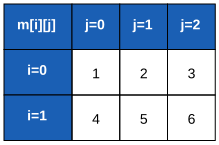
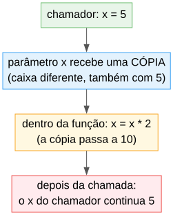
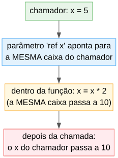
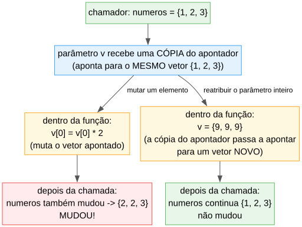
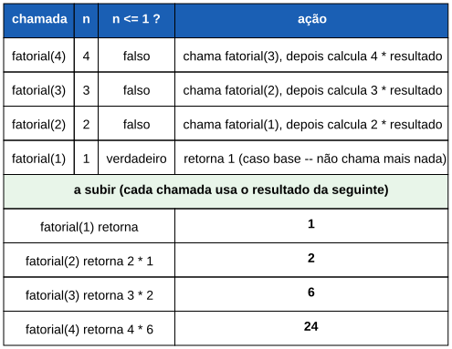
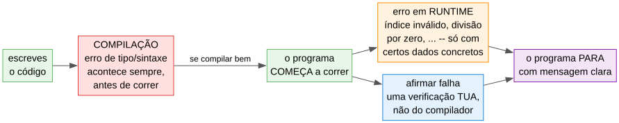

# Aula 11

## Revisão Final

Aulas 1 a 10 — sem matéria nova, todo o curso junto

---

## Porque esta revisão

Já viste tudo o que ALGO tem para ensinar sobre algoritmia: tipos, decisões, ciclos, vetores, funções, estruturas, bibliotecas. As próximas 3 aulas são só prática — antes disso, vale a pena ligar todos os pontos.

---

## O que vamos rever

1. Aulas 1-6 (recap rápido — já revimos a fundo na Aula 6)
2. Aula 7 — Vetores e matrizes
3. Aula 8 — Funções e procedimentos
4. Aula 9 — Estruturas
5. Aula 10 — Bibliotecas, `incluir`, `afirmar`
6. As armadilhas mais importantes do curso todo

---

# Recap rápido: Aulas 1 a 6

---

## Base da linguagem

```algo
algoritmo "Nome"

constante X:tipo = valor

inicio
    var:tipo = valor
    escrever(...)
    ler(var)

    se condicao entao
        ...
    senao se outraCondicao entao
        ...
    senao
        ...

    para i de 1 ate 5 fazer
        ...
    enquanto condicao fazer
        ...
```

---

## Operadores, num relance

```
+  -  *  /  div  mod  ^         // aritméticos
== <> < > <= >=                  // relacionais (não encadeiam!)
e  ou  nao                       // lógicos
```

`/` é sempre `decimal`. A condição de `se`/`enquanto` é sempre `booleano`.

---

# Aula 7 — Vetores e Matrizes

---

## Cheat sheet

```algo
v:inteiro[5]              // índices 0..4
v[0] = 10
primos:inteiro[5] = {2, 3, 5, 7, 11}

m:inteiro[2][3]           // matriz: m[i][j]
m:inteiro[2][2] = {{1, 2}, {3, 4}}
```

---

## Em tabela



---

## Armadilhas

- Índice inválido é erro em **runtime**, não em compilação
- Índice **negativo** não conta a partir do fim (diferente de Python)
- `=` **não** copia um vetor — as duas variáveis passam a apontar para o mesmo vetor; `==` compara se é o mesmo vetor, não o conteúdo

---

# Aula 8 — Funções e Procedimentos

---

## Cheat sheet

```algo
funcao dobro(x:inteiro):inteiro
    retornar x * 2

procedimento saudar(nome:cadeia)
    escrever("Olá, ", nome)
```

`funcao` devolve valor (`retornar` obrigatório em todos os caminhos); `procedimento` não.

---

## Por valor vs. `ref`



---



---

## Cuidado: vetor/estrutura por valor não é uma cópia "a sério"



Mutar um elemento/campo propaga; reatribuir o parâmetro inteiro não. Sem `ref`, mas com o mesmo perigo de aliasing da Aula 7/9.

---

## Recursão



Caso base + aproximação do caso base, sempre.

---

# Aula 9 — Estruturas

---

## Cheat sheet

```algo
estrutura Ponto
    x:inteiro
    y:inteiro

p:Ponto = {x: 3, y: 4}
p.x = 10
```

---

## `estrutura` é um tipo por referência (tal como vetor!)

```algo
a:Ponto = {x: 1, y: 2}
b:Ponto = a
b.x = 99
escrever(a.x, " ", b.x)       // 99 99 -- é a MESMA instância
```

`=`, declaração, `retornar`, argumento sem `ref`, e popular um campo/elemento a partir de uma variável existente num literal `{...}` nunca copiam — vetor e `estrutura` comportam-se da mesma forma em todo o lado. Isto já basta para ligar nós de uma lista ligada dinamicamente (`no.seguinte = outroNo`), sem precisar de `ref` nenhum em campos.

---

## `==` compara por referência, não por conteúdo

```algo
a:Ponto = {x: 1, y: 2}
b:Ponto = {x: 1, y: 2}
escrever(a == b)      // falso! mesmo conteúdo, instâncias diferentes
```

Para comparar conteúdo, escreve a tua própria função campo a campo.

---

# Aula 10 — Bibliotecas, `incluir`, `afirmar`

---

## Cheat sheet

```algo
importar Matematica            // matematica.raiz(x), .absoluto(x), ...
importar Cadeia                // cadeia.comprimento(s), .maiusculas(s), ...
importar Conversao             // conversao.paraInteiro(x), ...

incluir "ficheiro.algo" como f  // as tuas próprias funções: f.funcao(...)

afirmar condicao, "mensagem"    // para logo se for falsa; nunca desativado
```

---

## Três momentos, três tipos de erro



---

# As armadilhas mais importantes do curso

---

## 10 erros que todos cometemos

1. Condição de `se`/`enquanto` que não é `booleano`
2. `+` a misturar texto com número
3. Variável de `para` sem estar declarada antes
4. Usar uma variável de dentro de um `se`/`escolher` fora dele
5. Esquecer o acumulador/contador a `0` antes do ciclo

---

## Mais 5

6. Índice de vetor inválido (incluindo negativo) — só dá erro ao correr
7. Usar `==` para comparar o **conteúdo** de dois vetores/estruturas (compara se é o mesmo, não o conteúdo — falso mesmo com valores iguais)
8. `funcao` sem `retornar` em todos os caminhos
9. Esperar que mudar uma variável `ref` de uma função **não** mude o original
10. Esperar que `b = a` (vetor/`estrutura`) dê uma cópia independente — não dá; `b` fica ligado ao mesmo `a`

---

## Exemplo integrador: sistema de inventário

Junta estrutura, vetor de estruturas, função, biblioteca, `afirmar`, ciclos e decisões — tudo o que o curso ensinou:

```algo
algoritmo "SistemaInventario"

importar Cadeia

estrutura Produto
    nome:cadeia
    preco:decimal
    stock:inteiro

constante STOCK_MINIMO:inteiro = 5

funcao valorTotalStock(produtos:Produto[], tamanho:inteiro):decimal
    total:decimal = 0.0
    i:inteiro
    para i de 0 ate tamanho - 1 fazer
        total = total + produtos[i].preco * produtos[i].stock
    retornar total
```

---

## (continuação)

```algo
inicio
    n:inteiro
    escrever("Quantos produtos? ")
    ler(n)

    produtos:Produto[n]
    i:inteiro
    para i de 0 ate n - 1 fazer
        produtos[i] = {}      // vetor de 'estrutura' começa com posições 'nulo'; constrói cada uma
        escrever("Nome: ")
        ler(produtos[i].nome)
        escrever("Preço: ")
        ler(produtos[i].preco)
        afirmar produtos[i].preco > 0.0, "o preço tem de ser positivo"
        escrever("Stock: ")
        ler(produtos[i].stock)

    para i de 0 ate n - 1 fazer
        estado:cadeia = "stock normal"
        se produtos[i].stock < STOCK_MINIMO entao
            estado = "STOCK BAIXO"
        escrever(cadeia.maiusculas(produtos[i].nome), ": ", produtos[i].stock, " unidades -- ", estado)

    escrever("Valor total em stock: ", valorTotalStock(produtos, n))
```

---

## Resumo geral

- Base: tipos, `constante`, operadores, `se`/`escolher`, `para`/`enquanto`
- Vetores/matrizes: índices desde 0; `=` não copia, `==` compara por referência
- Funções: por valor vs `ref`, `retornar` obrigatório, recursão
- Estruturas: tipo por referência em toda a parte, tal como vetor; `ref` num parâmetro propaga reatribuições completas
- Bibliotecas/`incluir`/`afirmar`: ferramentas prontas, organização, verificação

---

## Próximas aulas

As últimas 3 aulas são só de **prática**, cada uma com um tema diferente e dificuldade crescente: vida quotidiana e finanças, jogos e simulações, e organização de dados (mini-projeto final).

---

## Agora é a tua vez!

Abre a ficha de trabalho da Aula 11 — o desafio final antes da prática livre.
